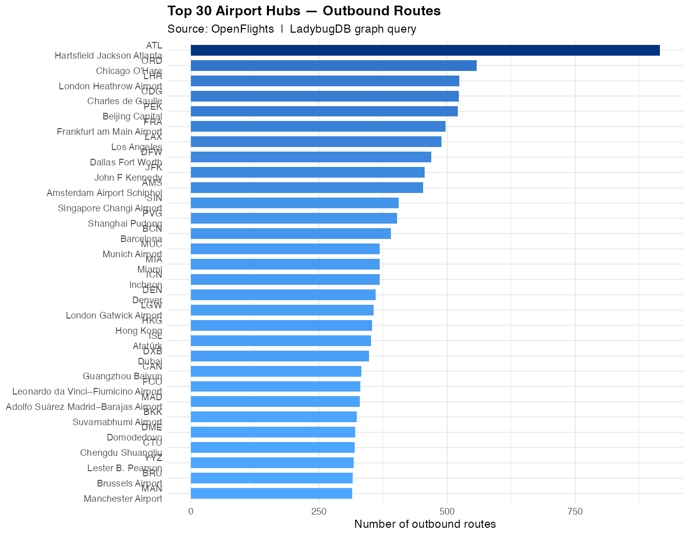
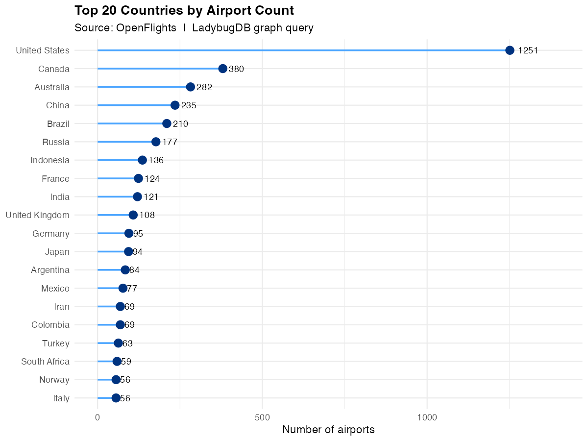
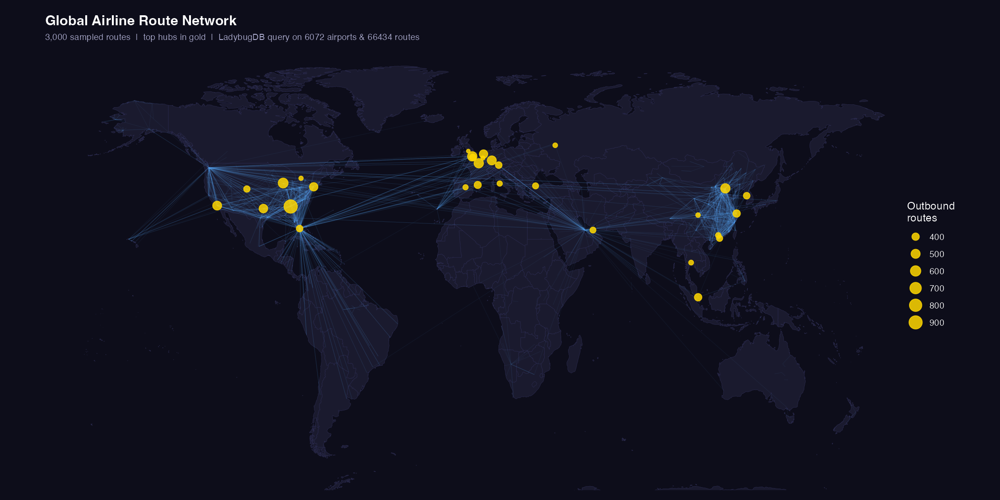
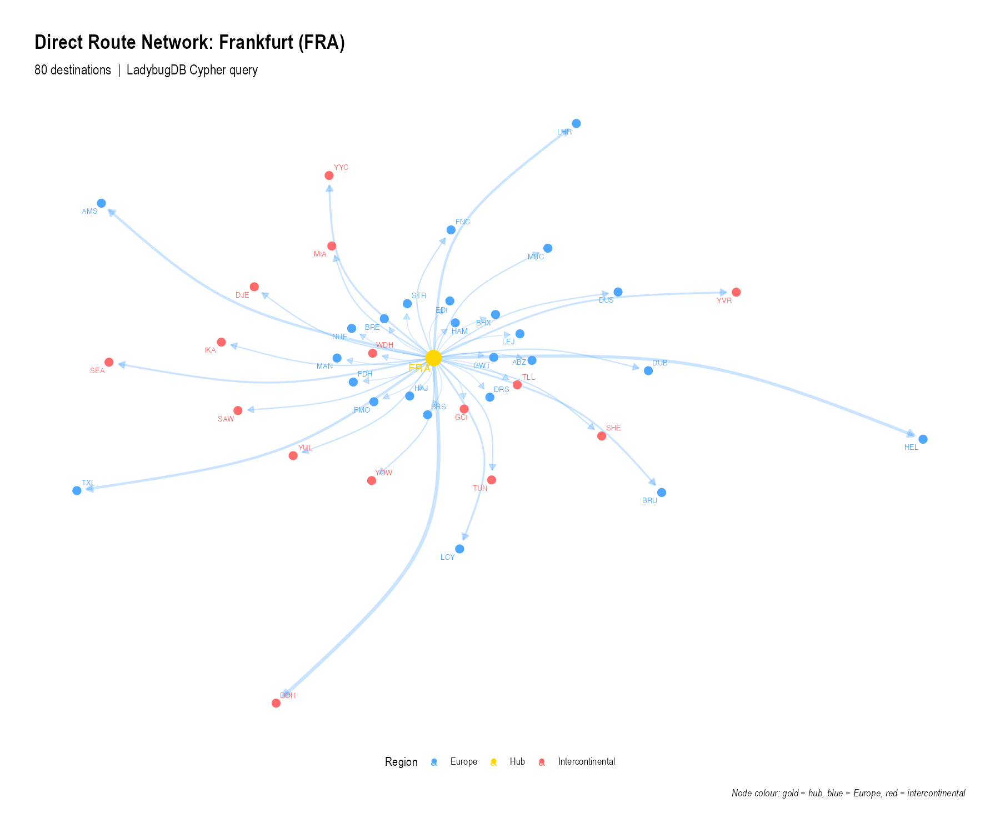

```{r setup, include = FALSE}
knitr::opts_chunk$set(
  collapse  = TRUE,
  comment   = "#>",
  eval      = FALSE
)
```

This article walks through a complete, real-world graph-analysis workflow using
the [OpenFlights](https://openflights.org/data) dataset: ~7 700 airports and
~67 000 airline routes loaded into an in-memory LadybugDB graph.

The full script is at `example_openflights.R` in the package source. The code
blocks below are shown for reference (`eval = FALSE`) and can be run with:

```r
Rscript example_openflights.R
```

---

## 1. Download the data

OpenFlights publishes two CSV files: airports and routes. We download them to
a temporary directory at the start of each session.

```{r download}
library(rladybugdb)
suppressPackageStartupMessages({
  library(ggplot2)
  library(dplyr)
})

base_url     <- "https://raw.githubusercontent.com/jpatokal/openflights/master/data"
airports_file <- file.path(tempdir(), "airports.dat")
routes_file   <- file.path(tempdir(), "routes.dat")

download.file(paste0(base_url, "/airports.dat"), airports_file, quiet = TRUE)
download.file(paste0(base_url, "/routes.dat"),   routes_file,   quiet = TRUE)
```

## 2. Parse into data frames

The raw files are comma-separated with no header row. We assign column names
manually and filter to real airports that have a valid IATA code and coordinates.

```{r parse}
airports_raw <- read.csv(airports_file, header = FALSE, quote = '"',
                         stringsAsFactors = FALSE, na.strings = c("", "\\N"),
                         col.names = c("id","name","city","country","iata","icao",
                                       "lat","lng","alt","tz","dst","tz_name","type","source"))

routes_raw <- read.csv(routes_file, header = FALSE, quote = '"',
                       stringsAsFactors = FALSE, na.strings = c("", "\\N"),
                       col.names = c("airline","airline_id","src_iata","src_id",
                                     "dst_iata","dst_id","codeshare","stops","equipment"))

# Keep only real airports with valid coordinates and IATA codes
airports <- airports_raw |>
  filter(type == "airport", nchar(iata) == 3,
         !is.na(lat), !is.na(lng), !is.na(id)) |>
  transmute(
    id      = as.integer(id),
    name    = name,
    city    = city,
    country = country,
    iata    = iata,
    lat     = as.double(lat),
    lng     = as.double(lng),
    alt     = as.integer(ifelse(is.na(alt), 0L, as.integer(alt)))
  )

# Keep routes where both endpoints reference known airports
known_ids <- airports$id
routes <- routes_raw |>
  filter(!is.na(src_id), !is.na(dst_id),
         suppressWarnings(!is.na(as.integer(src_id))),
         suppressWarnings(!is.na(as.integer(dst_id)))) |>
  transmute(
    src_id  = as.integer(src_id),
    dst_id  = as.integer(dst_id),
    airline = ifelse(is.na(airline), "Unknown", airline),
    stops   = as.integer(ifelse(is.na(stops), 0L, stops))
  ) |>
  filter(src_id %in% known_ids, dst_id %in% known_ids, src_id != dst_id)
```

After filtering we have roughly **6 200 airports** and **63 000 routes**.

## 3. Load into LadybugDB

We model airports as nodes and routes as directed edges. The graph schema uses
one node table (`Airport`) and one relationship table (`Route`).

```{r schema}
db   <- lb_database(":memory:")
conn <- lb_connection(db)

lb_execute(conn, "
  CREATE NODE TABLE Airport (
    id      INT64,
    name    STRING,
    city    STRING,
    country STRING,
    iata    STRING,
    lat     DOUBLE,
    lng     DOUBLE,
    alt     INT64,
    PRIMARY KEY(id)
  )")

lb_execute(conn, "
  CREATE REL TABLE Route (
    FROM Airport TO Airport,
    airline STRING,
    stops   INT64
  )")
```

`lb_copy_from_df()` uses LadybugDB's native bulk loader, which is orders of
magnitude faster than row-by-row `CREATE` statements:

```{r load}
lb_copy_from_df(conn, airports, "Airport")
lb_copy_from_df(conn, routes,   "Route")
```

## 4. Graph statistics

Simple aggregate Cypher queries confirm the data loaded correctly:

```{r stats}
lb_query(conn, "
  MATCH (a:Airport)
  RETURN count(a) AS total_airports")

lb_query(conn, "
  MATCH ()-[r:Route]->()
  RETURN count(r) AS total_routes")
```

## 5. Top airport hubs

Which airports have the most outbound routes? We aggregate with `count()`,
filter to airports with more than 10 routes, and take the top 30:

```{r top-hubs}
top_hubs <- lb_query(conn, "
  MATCH (a:Airport)-[r:Route]->()
  WITH a.iata AS iata, a.name AS name, a.country AS country,
       a.lat AS lat, a.lng AS lng, count(r) AS routes
  WHERE routes > 10
  RETURN iata, name, country, lat, lng, routes
  ORDER BY routes DESC
  LIMIT 30")
```

```{r plot-hubs, eval = FALSE}
p1 <- top_hubs |>
  mutate(label = paste0(iata, "\n", sub(" International.*", "", name))) |>
  ggplot(aes(x = reorder(label, routes), y = routes, fill = routes)) +
  geom_col(width = 0.7) +
  scale_fill_gradient(low = "#4da6ff", high = "#003380", guide = "none") +
  coord_flip() +
  labs(title = "Top 30 Airport Hubs — Outbound Routes",
       subtitle = "Source: OpenFlights  |  LadybugDB graph query",
       x = NULL, y = "Number of outbound routes") +
  theme_minimal(base_size = 11) +
  theme(plot.title = element_text(face = "bold"))
```

```{r show-hubs, echo = FALSE, eval = TRUE}

```

Frankfurt (FRA), London Heathrow (LHR), and Charles de Gaulle (CDG) dominate
the top of the list, reflecting their role as major intercontinental connecting
hubs.

## 6. Countries with the most airports

```{r by-country}
by_country <- lb_query(conn, "
  MATCH (a:Airport)
  WITH a.country AS country, count(a) AS n_airports
  RETURN country, n_airports
  ORDER BY n_airports DESC
  LIMIT 20")
```

```{r show-country, echo = FALSE, eval = TRUE}

```

The United States leads by a wide margin, followed by Russia and Canada — a
reflection of large geographic size with many regional airports.

## 7. World map of airline routes

To produce the world map we sample 3 000 route segments and overlay the top
hub locations:

```{r route-map-query}
route_map <- lb_query(conn, "
  MATCH (src:Airport)-[r:Route]->(dst:Airport)
  WHERE src.lng IS NOT NULL AND dst.lng IS NOT NULL
  RETURN src.lat AS src_lat, src.lng AS src_lng,
         dst.lat AS dst_lat, dst.lng AS dst_lng,
         src.country AS country
  LIMIT 3000")
```

```{r show-world-map, echo = FALSE, eval = TRUE}

```

The density of routes across the North Atlantic and within North America and
Europe is immediately visible. The relative scarcity of routes across the South
Pacific is also striking.

## 8. Frankfurt hub network

We extract the one-hop neighbourhood of Frankfurt (FRA) — all airports reachable
by a direct Lufthansa or partner flight — and visualise it as a network graph
using `ggraph`:

```{r fra-subgraph}
hub_net <- lb_query(conn, "
  MATCH (src:Airport {iata: 'FRA'})-[r:Route]->(dst:Airport)
  RETURN src.iata AS src, dst.iata AS dst,
         dst.name AS dst_name, dst.country AS dst_country,
         dst.lat AS dst_lat, dst.lng AS dst_lng,
         r.airline AS airline
  LIMIT 80")
```

```{r fra-network-build, eval = FALSE}
library(igraph)
library(ggraph)

vertices <- data.frame(
  name    = unique(c("FRA", hub_net$dst)),
  country = c("Germany",
               hub_net$dst_country[match(unique(hub_net$dst), hub_net$dst)]),
  stringsAsFactors = FALSE
)

europe <- c("Germany","France","United Kingdom","Spain","Italy","Netherlands",
            "Switzerland","Austria","Belgium","Poland","Sweden","Norway",
            "Denmark","Finland","Portugal","Greece","Czech Republic","Romania",
            "Hungary","Ireland","Croatia","Slovakia","Bulgaria","Serbia")

edges_ig <- hub_net |> count(src, dst, name = "weight")
g <- graph_from_data_frame(edges_ig, directed = TRUE, vertices = vertices)
V(g)$region <- ifelse(V(g)$name == "FRA", "Hub",
                ifelse(V(g)$country %in% europe, "Europe", "Intercontinental"))
```

```{r show-fra-network, echo = FALSE, eval = TRUE}

```

Gold = Frankfurt hub, blue = European destinations, red = intercontinental
destinations. The hub-and-spoke structure is clearly visible.

## 9. Cleanup

```{r cleanup}
lb_close(conn)
lb_close(db)
```

---

## Data model summary

| Element | LadybugDB object | Key properties |
|---------|-----------------|----------------|
| Airport node | `NODE TABLE Airport` | `id` (PK), `iata`, `name`, `lat`, `lng` |
| Route edge | `REL TABLE Route` | `FROM Airport TO Airport`, `airline`, `stops` |

## Cypher patterns used

| Pattern | Purpose |
|---------|---------|
| `MATCH (a:Airport)-[r:Route]->()` | Traverse outbound edges |
| `WITH … count(r) AS routes` | Aggregate degree per node |
| `WHERE routes > 10` | Filter after aggregation |
| `ORDER BY … DESC LIMIT 30` | Top-N ranking |
| `{iata: 'FRA'}` | Node property filter (inline) |
